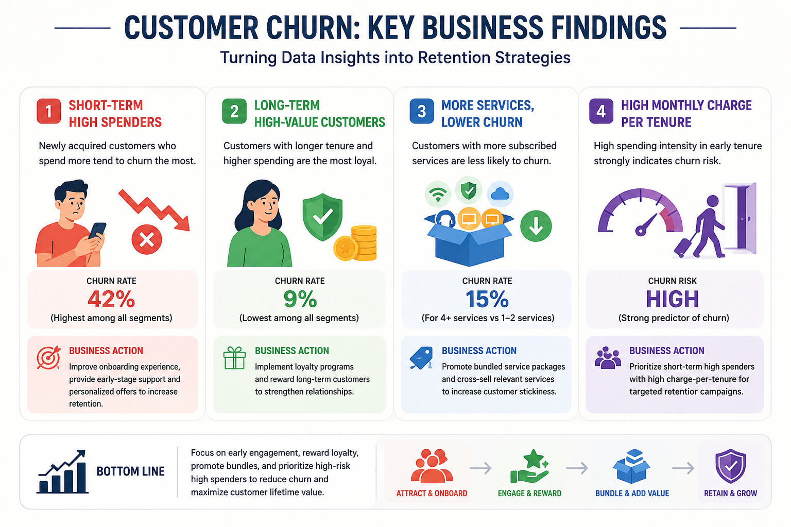
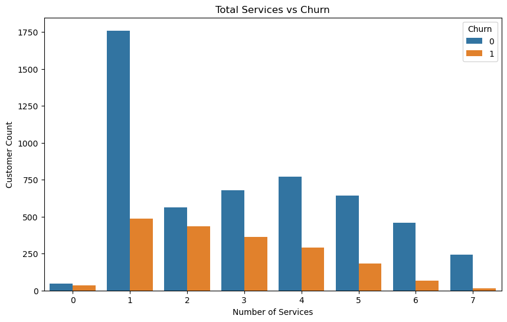
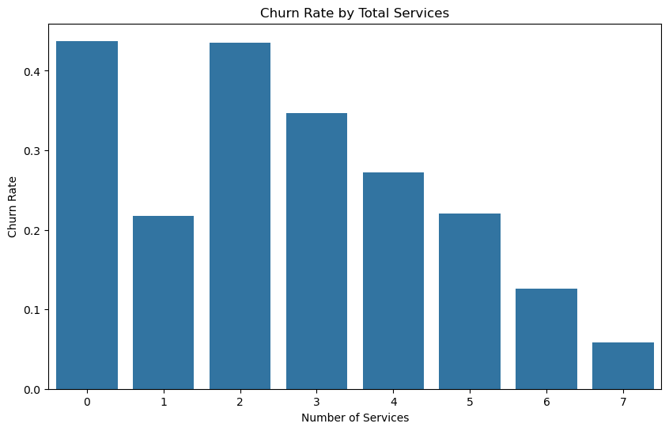
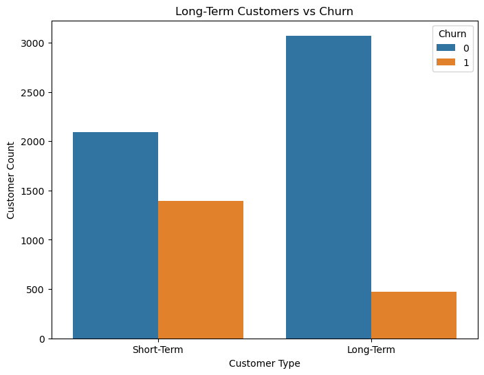
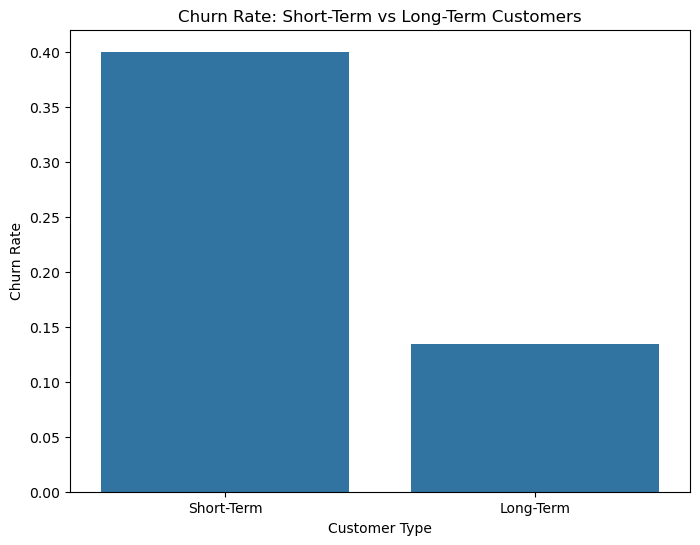
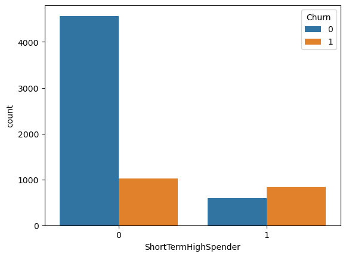
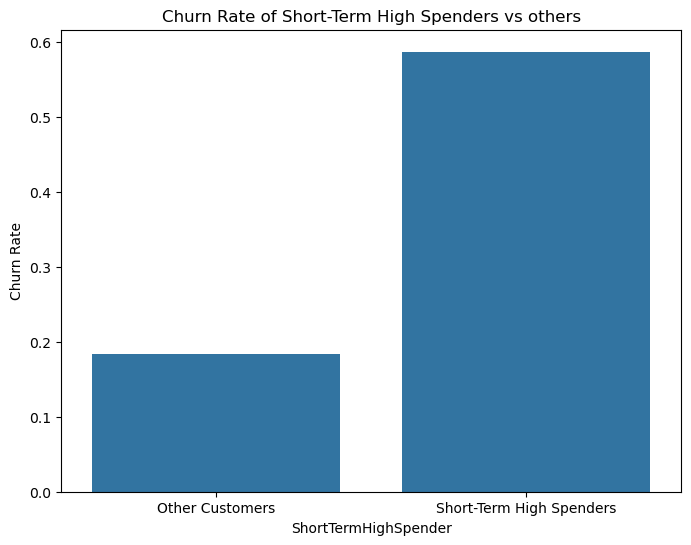
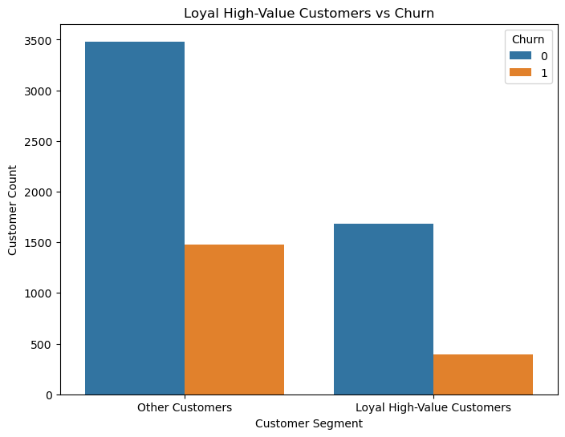
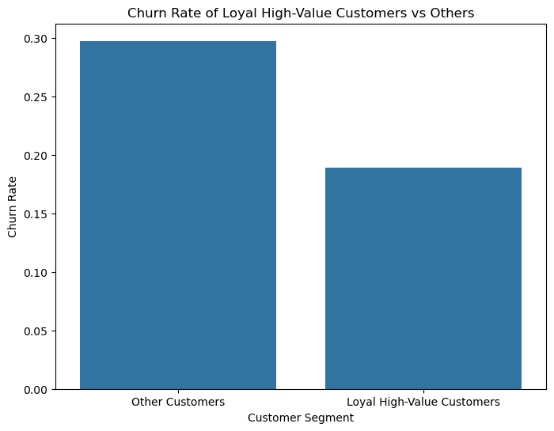
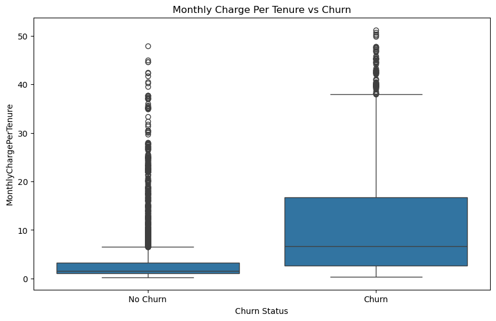

# telco-customer-churn-prediction

End-to-end customer churn analysis and machine learning project combining predictive modeling, feature engineering, customer lifecycle analysis, and business-oriented behavioral insights to understand and reduce telecom customer churn.

---
# Business Problem

Customer churn is one of the most important business challenges in the telecommunications industry. Retaining existing customers is often significantly cheaper than acquiring new customers.

This project aims to:

- Predict customer churn using machine learning
- Identify major churn drivers
- Engineer behavioral customer segments
- Analyze customer lifecycle dynamics
- Compare multiple classification models and encoding strategies


---

# Key Business Finidngs

| Finding | Observation | Business Recommendation |
|---|---|---|
| Short-Term High Spenders | Newly acquired high-spending customers exhibited substantially elevated churn rates. | Improve onboarding experience, customer support, and early-stage retention offers for premium new customers. |
| Long-Term High-Value Customers | Long-term premium customers demonstrated significantly stronger retention stability. | Develop loyalty programs and long-term customer reward incentives. |
| Service Bundling | Customers subscribed to more telecom services generally showed lower churn tendencies. | Promote bundled service packages to strengthen ecosystem integration and reduce switching behavior. |
| Spending Intensity | Customers with high spending intensity relative to tenure (`MonthlyChargePerTenure`) were much more likely to churn early. | Prioritize retention targeting for high-spending early-stage customers before churn occurs. |

<p align="center">
  
</p>


---

# Dataset

Dataset source: [Kaggle Telco Customer Churn Dataset](https://www.kaggle.com/datasets/blastchar/telco-customer-churn)

### Dataset Overview

# Features Description

| Category | Features |
|---|---|
| Customer Information | `customerID`, `gender`, `SeniorCitizen`, `Partner`, `Dependents` |
| Account Information | `tenure`, `Contract`, `PaperlessBilling`, `PaymentMethod` |
| Phone Services | `PhoneService`, `MultipleLines` |
| Internet Services | `InternetService`, `OnlineSecurity`, `OnlineBackup`, `DeviceProtection`, `TechSupport`, `StreamingTV`, `StreamingMovies` |
| Billing Information | `MonthlyCharges`, `TotalCharges` |
| Target Variable | `Churn` |


- `tenure` represents the number of months a customer has remained with the company.
- `MonthlyCharges` and `TotalCharges` are continuous numerical variables.
- `Churn` is the target variable:
  - `Yes (1)` = customer left the company
  - `No (0)` = customer stayed with the company

---


# Project Workflow

The project followed the following machine learning workflow:

1. Data cleaning and preprocessing
2. Exploratory Data Analysis (EDA)
3. Binary encoding and one-hot encoding
4. Comparison of:
   - full one-hot encoding
   - reduced one-hot encoding (`drop_first=True`)
5. Machine learning model comparison
6. Hyperparameter optimization
7. Feature engineering
8. Feature importance analysis
9. Key findings
10. Conclusion

---

# Exploratory Data Analysis (EDA)


## Binary encoding and one-hot encoding 

### Binary Encoding

Features containing two categories were binary encoded into `0` and `1`.

Examples:

| Original Feature | Encoded Representation |
|---|---|
| `gender` | Male = 1, Female = 0 |
| `Partner` | Yes = 1, No = 0 |
| `Dependents` | Yes = 1, No = 0 |

Binary encoding preserves information while simplifying categorical variables into machine-readable numerical format.

---

### One-Hot Encoding

Features containing more than two categories were transformed using one-hot encoding.

Example:

| Original Feature | Categories |
|---|---|
| `Contract` | Month-to-month, One year, Two year |

became:

| Encoded Columns |
|---|
| `Contract_Month-to-month` |
| `Contract_One year` |
| `Contract_Two year` |

Each encoded column represents whether a customer belongs to that category (`1`) or not (`0`).

---

## Full vs Reduced One-Hot Encoding

Two encoding strategies were compared:

### Full Encoding (`drop_first=False`)

All generated dummy variables were retained.

Example:

| Contract_Month-to-month | Contract_One year | Contract_Two year |
|---|---|---|
| 1 | 0 | 0 |

Advantages:
- retains complete category information
- easier interpretability during EDA and visualization

Disadvantages:
- introduces redundant information
- may create multicollinearity for linear models

---

### Reduced Encoding (`drop_first=True`)

The first category was removed during one-hot encoding.

Example:

| Contract_One year | Contract_Two year |
|---|---|
| 0 | 0 |

In this case:
- both `0` values implicitly represent `Month-to-month`

Advantages:
- reduces feature redundancy
- mitigates multicollinearity
- preferred for many linear models

Disadvantages:
- slightly less intuitive during interpretation

---

## Encoding Comparison Results

Both encoding strategies produced highly similar predictive performance across machine learning models.

This suggests that:
- redundant dummy variables had limited impact on predictive performance
- tree-based ensemble models were generally robust to encoding redundancy
- reduced encoding offered a cleaner and more compact feature representation

---

# Machine Learning Models

The following classification models were evaluated:

- Logistic Regression
- K-Nearest Neighbors (KNN)
- Random Forest
- AdaBoost
- Gradient Boosting
- XGBoost

---

# Hyperparameter Optimization

Hyperparameter optimization was performed using:
- GridSearchCV
- RandomizedSearchCV

---

# Feature Engineering

Behavioral and lifecycle-oriented features were engineered to better capture customer retention dynamics and customer spending behavior.

These engineered features aimed to move beyond raw demographic and service information by modeling customer lifecycle patterns, spending intensity, and behavioral segmentation.

## Engineered Features

### `TotalServices`
Total number of subscribed telecom services per customer.

### Included Services

- PhoneService
- OnlineSecurity
- OnlineBackup
- DeviceProtection
- TechSupport
- StreamingTV
- StreamingMovies

<p align="center">
  
  
</p>

### `LongTermCustomer`

Binary indicator identifying customers with tenure above the dataset median (29 months).

```python
LongTermCustomer = 1 if tenure >= median(tenure)
```


<p align="center">
  
  
</p>


### `ShortTermHighSpender`
Customers with:
- below-median tenure
- above-median monthly charges

<p align="center">
  
  
</p>


This feature captured newly acquired premium-paying customers.

### `LoyalHighValueCustomer`

Customers with:
- above-median tenure
- above-median monthly charges

<p align="center">
  
  
</p>

This feature represented stable premium customers.

### `MonthlyChargePerTenure`
Behavioral feature capturing spending intensity relative to customer lifetime.

```python
df_drop['MonthlyChargePerTenure'] = (
    df_drop['MonthlyCharges']
    / (df_drop['tenure'] + 1))
```
<p align="center">
  
</p>

---


# Model Performance Summary 

## Main Results Table 

| Experiment | Best Model | Test Acc | ROC-AUC | Recall (Churn) | F1 (Churn) |
|---|---|---|---|---|---|
|Full Encoding|Logistic Regression|0.804|0.835|0.57|0.61|
|Drop-First Encoding|Logistic Regression|0.804|0.836|0.57|0.61|
|Feature Engineered|Gradient Boosting|0.800|0.841|0.53|0.58|
|Engineered Features Only|XGBoost|0.781|0.826|0.44|0.51|


### Full One-Hot Encoding (`drop_first=False`)

| Model | Train Acc | Test Acc | ROC-AUC | Precision (Churn) | Recall (Churn) | F1 (Churn) |
|---|---|---|---|---|---|---|
| Logistic Regression | 0.804 | 0.804 | 0.835 | 0.65 | 0.57 | 0.61 |
| KNN | 0.838 | 0.743 | 0.769 | 0.52 | 0.52 | 0.52 |
| XGBoost | 0.822 | 0.798 | 0.839 | 0.64 | 0.54 | 0.59 |
| AdaBoost | 0.807 | 0.793 | 0.836 | 0.63 | 0.54 | 0.58 |
| Gradient Boosting | 0.819 | 0.796 | 0.839 | 0.64 | 0.53 | 0.58 |
| Random Forest | 0.856 | 0.795 | 0.833 | 0.64 | 0.52 | 0.58 |

### Reduced One-Hot Encoding (`drop_first=True`)

| Model | Train Acc | Test Acc | ROC-AUC | Precision (Churn) | Recall (Churn) | F1 (Churn) |
|---|---|---|---|---|---|---|
| Logistic Regression | 0.804 | 0.804 | 0.836 | 0.65 | 0.57 | 0.61 |
| KNN | 0.835 | 0.754 | 0.767 | 0.54 | 0.54 | 0.54 |
| XGBoost | 0.827 | 0.792 | 0.838 | 0.63 | 0.53 | 0.58 |
| AdaBoost | 0.808 | 0.792 | 0.842 | 0.64 | 0.51 | 0.57 |
| Gradient Boosting | 0.817 | 0.794 | 0.842 | 0.64 | 0.52 | 0.57 |
| Random Forest | 0.866 | 0.790 | 0.833 | 0.63 | 0.51 | 0.56 |

### Feature Engineered

| Model | Train Acc | Test Acc | ROC-AUC | Precision (Churn) | Recall (Churn) | F1 (Churn) |
|---|---|---|---|---|---|---|
| Logistic Regression | 0.813 | 0.799 | 0.839 | 0.64 | 0.55 | 0.59 |
| KNN | 0.833 | 0.768 | 0.772 | 0.57 | 0.55 | 0.56 |
| XGBoost | 0.829 | 0.798 | 0.839 | 0.64 | 0.54 | 0.59 |
| AdaBoost | 0.807 | 0.796 | 0.838 | 0.64 | 0.53 | 0.58 |
| Gradient Boosting | 0.820 | 0.800 | 0.841 | 0.65 | 0.53 | 0.58 |
| Random Forest | 0.873 | 0.788 | 0.832 | 0.63 | 0.49 | 0.55 |

### Engineered features only
| Model | Train Acc | Test Acc | ROC-AUC | Precision (Churn) | Recall (Churn) | F1 (Churn) |
|---|---|---|---|---|---|---|
| Logistic Regression | 0.787 | 0.778 | 0.806 | 0.64 | 0.38 | 0.48 |
| KNN | 0.731 | 0.768 | 0.745 | 0.58 | 0.44 | 0.50 |
| XGBoost | 0.801 | 0.781 | 0.826 | 0.63 | 0.44 | 0.51 |
| AdaBoost | 0.797 | 0.775 | 0.813 | 0.59 | 0.51 | 0.54 |
| Gradient Boosting | 0.817 | 0.794 | 0.842 | 0.64 | 0.52 | 0.57 |
| Random Forest | 0.843 | 0.775 | 0.808 | 0.60 | 0.45 | 0.51 |


---

# Key Findings

- Logistic Regression achieved the strongest overall balance between generalization and churn detection performance.
- Feature engineering improved interpretability and slightly improved several ensemble models.
- `MonthlyChargePerTenure` emerged as one of the strongest behavioral churn indicators across multiple ensemble models.
- Short-term high spenders exhibited substantially elevated churn rates.
- Long-term high-value customers demonstrated greater retention stability.
- Engineered behavioral features alone retained relatively strong predictive performance, suggesting customer lifecycle behavior contains substantial churn-related signal.
- KNN performance improved when using a reduced behavioral feature space, likely due to lower dimensionality and reduced sparse one-hot encoding noise.

---

# Conclusion

This project explored telecom customer churn prediction through both predictive machine learning and business-oriented behavioral analysis.

While advanced ensemble models achieved strong predictive performance, feature engineering provided deeper insight into customer lifecycle behavior and retention dynamics.